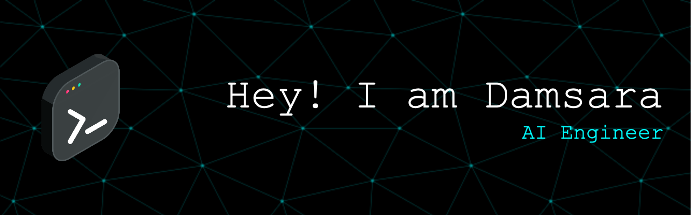

Hey there 👋

I’m Damsara, AI engineering student at coventry university. Committed to staying at the forefront of AI advancements through continuous learning and hands-on projects. Eager to contribute to cutting-edge developments that harness the power of AI for positive change.

## 📌 Pinned Repositories

 

 

 

 
 

## 💼 Skills

  
  
  
  
  
  
  
  
  
  
  
  
  
  
  
  
  
  
  
  
  
  
  
  
  
  
  
  
  
  
  
  
  
  
  
  
  
  
  
  
  
  
  

##

More Skills

 

 

 
